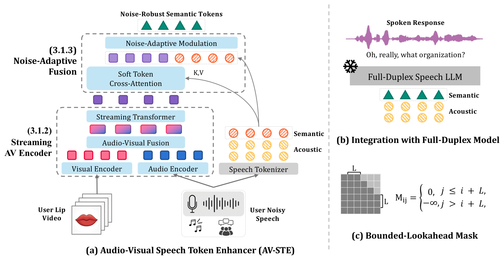

# AV-STE: Audio-Visual Speech Token Enhancement

> **EMNLP 2026** — *Audio-Visual Speech Token Enhancement for Robust Speech Synthesis under Noise*

AV-STE recovers clean Mimi semantic tokens from noisy speech by fusing audio features with lip-ROI video through an entropy-gated cross-attention module built on top of AV-HuBERT. Enhanced tokens can be fed directly into any Mimi-based TTS or codec LM (e.g. Moshi) in place of the noisy ones.



- **Input**: noisy 16 kHz WAV + 96×96 grayscale mouth-ROI MP4 at 25 fps
- **Output**: enhanced Mimi semantic(cb0) token sequence at 12.5 Hz

---

## Checkpoints

| Checkpoint | Use for |
|---|---|
| `avste.pt` | Clean speech, non-speech background noise, cross-dataset speaker interference |
| `avste_lrs3_interference.pt` | Same-corpus-style competing speakers, out-of-domain video |

Together they reproduce every semantic-token-accuracy row in the paper's main table. Full breakdown, download, and selection guidance: [checkpoints/README.md](checkpoints/README.md).

**Data/code availability:** this repo and the checkpoints (weights we trained, not a dataset redistribution) are the full release. LRS3, AudioSet, and Seamless Interaction are third-party/license-gated — we don't host or redistribute their media. For the 125-clip LRS3 dialogue evaluation set, we publish clip IDs + a sampling script to reconstruct it from your own LRS3 license: [`dataset_reproduction/lrs3_dialog_test/`](dataset_reproduction/lrs3_dialog_test/).

---

## Setup

```bash
git clone https://github.com/bellagodiva/av-ste.git
cd av-ste

conda create -n avste python=3.10 -y
conda activate avste
pip install -r requirements.txt
pip install -e av_hubert/fairseq/
```

Download checkpoints (`avste.pt`, `avste_lrs3_interference.pt`, and the public AV-HuBERT-Large backbone `large_vox_iter5.pt` needed to build the architecture):

```bash
bash scripts/download_checkpoint.sh
```

---

## Demo

```bash
bash examples/run_demo.sh
```

Runs AV-STE on four bundled LRS3 clips (speech noise / ambient noise, each at −10 dB and −5 dB), then prints two tables: semantic-token accuracy + Mimi-decoded WER (**Table A**), and Moshi's generated response when fed each condition's tokens (**Table B**).

```
  Table A — Speech noise −5 dB — Mimi decode
  Reference: BUT IF THEY DON'T STAY IN PARIS THE INTERNATIONAL PRESSURE WILL BE OVERWHELMING
  ─────────────────────────────────────────────────────────────────────────
  Condition               Tok Acc (primary)  WER (secondary)   Transcript
  ─────────────────────────────────────────────────────────────────────────
  Clean (upper bound)                100.0%             0.0%   But if they don't stay in Paris, the international pressure…
  Noisy │ Mimi baseline               27.6%            61.5%   The problem is they don't stay in Paris. The international…
  Noisy │ AV-STE (ours)               79.3%            38.5%   What if they don't stay in Paris? The international questi…

  Table B — Speech noise −5 dB — Moshi streaming generation
  ─────────────────────────────────────────────────────────────────────────
  Condition               Input Tok Acc   Moshi's generated speech
  ─────────────────────────────────────────────────────────────────────────
  Clean (upper bound)          100.0%   That's true, and it's also possible that they could try to find a way to stay…
  Noisy │ Mimi baseline         27.6%   Yeah, I'm sure I've heard of that. What's it about?
  Noisy │ AV-STE (ours)         79.3%   That's true. They should at least try to stay in the city for a few days.
```

**Tok Acc** (primary) = fraction of predicted cb0 tokens matching the clean reference at 12.5 Hz. **WER** (secondary, diagnostic) = Whisper-large-v3 WER on the Mimi-decoded audio; at extreme noise levels Whisper can transcribe nothing, shown as `(empty transcript)` rather than a blank cell.

These four clips were picked for a clear before/after contrast, not as an average — see [Bundled samples](#bundled-samples). The paper's Table 1 numbers are averaged over the full 1321-clip test set. Mimi-decoded audio for every condition is saved to `outputs/compare_audio/`.

---

## Inference on your own audio

**1. Extract a lip-ROI clip** (96×96 grayscale mouth crop, 25 fps) from a face video with a visible, front-facing face:

```bash
curl -LO https://dlib.net/files/shape_predictor_68_face_landmarks.dat.bz2
bzip2 -d shape_predictor_68_face_landmarks.dat.bz2

python scripts/prepare_lip_roi.py \
    --input      face_video.mp4 \
    --output     lip_roi.mp4 \
    --landmarks  shape_predictor_68_face_landmarks.dat

ffmpeg -i your_audio.wav -ar 16000 -ac 1 noisy_16khz.wav
```

**2. Run inference.** `--output`'s file extension picks the format:

```bash
# Enhanced tokens only, for your own TTS/codec LM
python scripts/infer_avste.py \
    --audio noisy_16khz.wav --video lip_roi.mp4 \
    --checkpoint checkpoints/avste.pt \
    --output outputs/enhanced_tokens.pt --fp16

# (Optional) Reconstructed speech (enhanced tokens + noisy audio's own acoustic codebooks,
# decoded through Mimi) -- convenient for listening, but a diagnostic view;
# token accuracy is the metric that matters for downstream use
python scripts/infer_avste.py \
    --audio noisy_16khz.wav --video lip_roi.mp4 \
    --checkpoint checkpoints/avste.pt \
    --output outputs/enhanced_speech.wav --fp16
```

**3. Stream through Moshi** for a spoken dialogue response:

```bash
python scripts/infer_avste.py \
    --audio noisy_16khz.wav --video lip_roi.mp4 \
    --checkpoint checkpoints/avste.pt \
    --output outputs/my_predictions.json --utt_id my_clip_001 --fp16

python scripts/compare_demo.py \
    --pred_json outputs/my_predictions.json --utt_id my_clip_001 \
    --clean clean_16khz.wav --noisy noisy_16khz.wav --save_audio
```

`--pred_json`, `--utt_id`, `--clean`, and `--noisy` must all be passed together — omit any one and `compare_demo.py` silently falls back to the bundled demo clips instead of yours. No clean reference for your audio? Use step 2 directly. Output audio goes to `outputs/compare_audio/`.

---

## Bundled samples

Four LRS3 test clips in `examples/`, chosen to showcase recovery under noise, not as representative averages (e.g. the ambient-noise clips push the Mimi baseline to 0%, more extreme than Table 1's averages).

| Condition | Clip ID | Text | Files |
|---|---|---|---|
| Speech noise, −10 dB | `rP7nmdDA1Fg/00006` | *"I THINK WHAT THAT MEANS IS THAT PEOPLE JUST COULDN'T SEE WHAT WAS IN FRONT OF THEM"* | `sample_speech_clean.wav`, `sample_speech_lip.mp4`, `sample_noisy_speech.wav`, `predictions_speech_neg10.json` |
| Speech noise, −5 dB | `ta2Wvy9FSgA/00003` | *"BUT IF THEY DON'T STAY IN PARIS THE INTERNATIONAL PRESSURE WILL BE OVERWHELMING"* | `sample_speech_neg5_clean.wav`, `sample_speech_neg5_noisy.wav`, `predictions_speech_neg5.json` |
| Ambient/music noise, −10 dB | `w1R4F9sSoow/00003` | *"WE HAVE IDEAS FOR HOW TO MAKE THINGS BETTER AND I WANT TO SHARE THREE OF THEM THAT WE'VE PICKED UP IN OUR OWN WORK"* | `sample_other_neg10_clean.wav`, `sample_other_neg10_noisy.wav`, `predictions_other_neg10.json` |
| Ambient/music noise, −5 dB | `RplnSVTzvnU/00003` | *"WE CAN CREATE A DECENTRALIZED DATABASE THAT HAS THE SAME EFFICIENCY OF A MONOPOLY"* | `sample_other_neg5_clean.wav`, `sample_other_neg5_noisy.wav`, `predictions_other_neg5.json` |

All clean/lip files come from the speech-noise −10 dB clip's video; each row's `.json` holds AV-STE's predicted cb0 tokens at 25 Hz.

---

## Training

This repo includes the training config and launch script for both checkpoints. It does not include the data-prep pipeline that builds the manifests and noise pools (LRS3 manifest generation, AudioSet noise-pool construction, Mimi-logit pre-extraction, interferer selection) — that lives in a larger internal codebase. The methodology below is enough to reproduce it independently.

### Data

- **LRS3** — target speech, license-gated. Start at the [Oxford VGG lip-reading datasets page](https://www.robots.ox.ac.uk/~vgg/data/lip_reading/) for access, then preprocess with AV-HuBERT's standard pipeline (96×96 grayscale mouth crop, 25 fps).
- **AudioSet** — non-speech noise (clips without `Speech`/`Conversation` labels) and cross-dataset speaker interference (clips with those labels), mixed in at a uniformly sampled SNR in [-10, 10] dB.
- **Same-dataset LRS3 interference** — 1-4 interfering LRS3 speakers (excluding the target's own) summed and scaled to the target SNR.
- **Seamless Interaction** — out-of-domain eval only, no fine-tuning; preprocessed the same way as LRS3.
- **125-clip LRS3 dialogue eval set** — see [`dataset_reproduction/lrs3_dialog_test/`](dataset_reproduction/lrs3_dialog_test/) to reconstruct it from your own LRS3 license.

### Run

```bash
bash scripts/train.sh   # see the script header for required env vars
```

Both checkpoints are `av_hubert_crossattn_ent` models (4-frame lookahead, entropy-gated cross-attention, `mimi_mix_loss`), fine-tuned from `large_vox_iter5.pt`, config at [`configs/large_lrs3_433h_crossattn_ent.yaml`](configs/large_lrs3_433h_crossattn_ent.yaml). Both stages use a 20/40/40 clean/non-speech/speaker-interference mix, SNR uniform in [-10, 10] dB, Adam (0.9/0.98), tri-stage LR schedule, grad clip 5.0:

| | `avste.pt` (Stage 1) | `avste_lrs3_interference.pt` (Stage 2) |
|---|---|---|
| Started from | `large_vox_iter5.pt` | `avste.pt` |
| Peak LR | 1e-4 | 3e-5 |
| Warmup / decay steps | 4000 / 35000 | 1000 / 15000 |
| Max epochs | 6 | 3 |
| Interference source | AudioSet, 1 per sample | LRS3 speakers, 1-4 per sample |

### Evaluation

Given noisy audio + lip video, the model predicts an enhanced cb0 token sequence, scored two ways:

- **Semantic-token accuracy** (primary) — fraction of predicted tokens matching clean-audio tokens.
- **WER** (secondary) — enhanced tokens + noisy audio's acoustic codebooks, decoded via Mimi, transcribed with Whisper, scored against the clean transcript.

`infer_avste.py` and `compare_demo.py` compute these per clip; reproducing the paper's full Table 1 means running the same protocol over the entire LRS3 `noisy_test` split (1321 clips × 5 SNRs × noise types).

---

## Repository structure

```
av-ste/
├── av_hubert/
│   ├── avhubert/                # AV-HuBERT user_dir: task, data, and model
│   │   └── models/
│   │       └── avhubert_crossattn_ent.py   # AV-STE model (entropy-gated cross-attention)
│   └── fairseq/                 # bundled fairseq (install with pip install -e)
├── configs/                     # fairseq task / model configs
├── scripts/
│   ├── infer_avste.py           # single-clip inference
│   ├── compare_demo.py          # multi-condition comparison table
│   ├── prepare_lip_roi.py       # lip-ROI extraction from face video
│   ├── train.sh                 # train your own checkpoint (both stages)
│   └── download_checkpoint.sh
├── examples/
│   ├── run_demo.sh              # end-to-end demo script
│   └── sample_*.wav / *.mp4     # bundled LRS3 test clips
├── checkpoints/                 # place avste.pt + large_vox_iter5.pt here
├── requirements.txt
└── README.md
```
